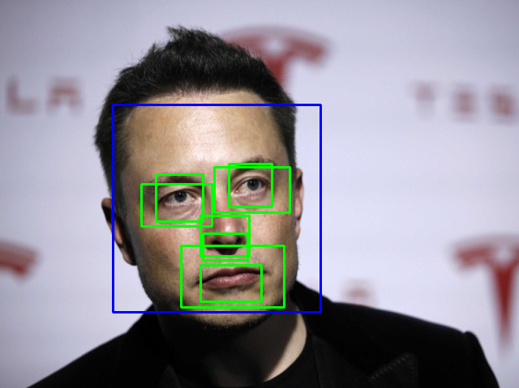
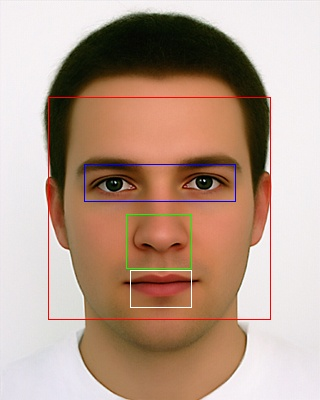

# Feature_Detector
A Realtime Eyes and Face Detection Model using classifiers like Haar Cascade classifier and learning image processing using Tensorflow with help of Python's OpenCV Library.

## Functionality and Features-
- The model can be used to effectively detect basic features on the human's face like eyes, nose,etc.
- It can be used in several other models to enhance their functionality and usability.
- It can be used to train any custom dataset with different images.

Here are some Screenshots-

# License
This uses the [MIT License](LICENSE) for fair use purpose.
